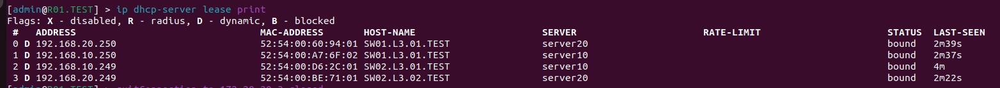
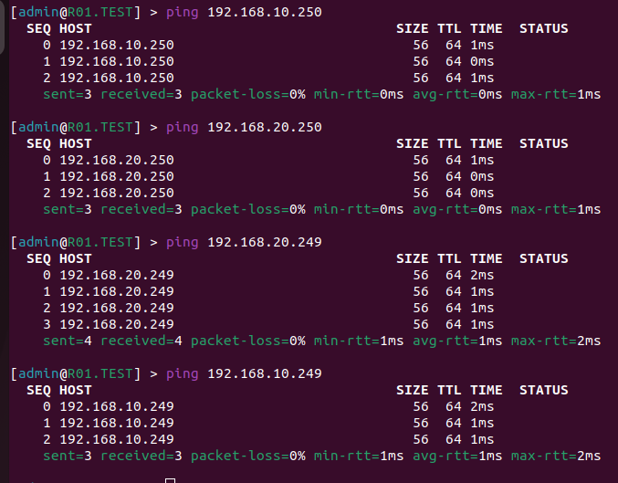
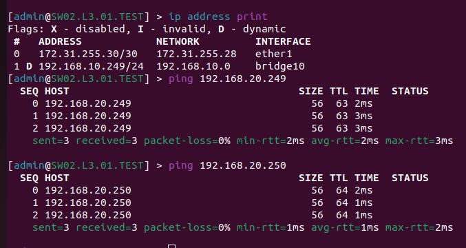

University: [ITMO University](https://itmo.ru/ru/)

Faculty: [FICT](https://fict.itmo.ru)

Course: [Introduction in routing](https://github.com/itmo-ict-faculty/introduction-in-routing)

Year: 2022/2023 

Group: K33202, K33212

Author: Guliaeva Alisa, Potitova Valentina 

Lab: Lab1 

Date of create: 20.09.2022 

Date of finished: 18.11.2022

<h1>Отчет по лабораторной №1</h1>
<h2>"Установка ContainerLab и развертывание тестовой сети связи"</h2>
<ul>
<li>Файл, который использовали для развертывания тестовой сети, находится в папке с лабораторной. Называется "lab1.yaml".</li>
<li>Схема связи находится в папке с лабораторной. Называется "Схема.jpeg".</li>
</ul>
<h3>Текст конфигураций для сетевых устройств</h3>

Для R01.TEST (sudo ssh admin@172.20.20.3): 

/interface vlan

add interface=ether2 name=vlan10 vlan-id=10

add interface=ether2 name=vlan20 vlan-id=20

/interface wireless security-profiles

set [ find default=yes ] supplicant-identity=MikroTik

/ip pool

add name=pool10 ranges=192.168.10.10-192.168.10.250

add name=pool20 ranges=192.168.20.10-192.168.20.250

/ip dhcp-server

add address-pool=pool10 disabled=no interface=vlan10 name=server10

add address-pool=pool20 disabled=no interface=vlan20 name=server20

/ip address

add address=172.31.255.30/30 interface=ether1 network=172.31.255.28

add address=192.168.10.1/24 interface=vlan10 network=192.168.10.0

add address=192.168.20.1/24 interface=vlan20 network=192.168.20.0

/ip dhcp-client

add disabled=no interface=ether1

/ip dhcp-server network

add address=192.168.10.0/24 gateway=192.168.10.1

add address=192.168.20.0/24 gateway=192.168.20.1

/system identity

set name=R01.TEST

Для SW01.L3.01.TEST (sudo ssh admin@172.20.20.4): 

/interface bridge

add name=bridge10

add name=bridge20

/interface vlan

add interface=ether2 name=vlan10 vlan-id=10

add interface=ether2 name=vlan20 vlan-id=20

add interface=ether3 name=vlan103 vlan-id=10

add interface=ether4 name=vlan203 vlan-id=20

/interface wireless security-profiles

set [ find default=yes ] supplicant-identity=MikroTik

/interface bridge port

add bridge=bridge20 interface=vlan20

add bridge=bridge20 interface=vlan203

add bridge=bridge10 interface=vlan103

add bridge=bridge10 interface=vlan10

/ip address

add address=172.31.255.30/30 interface=ether1 network=172.31.255.28

/ip dhcp-client

add disabled=no interface=ether1

add disabled=no interface=bridge10

add disabled=no interface=bridge20

/system identity

set name=SW01.L3.01.TEST

Для SW02.L3.01.TEST (sudo ssh admin@172.20.20.7): 

/interface bridge
 

add name=bridge10
 

/interface vlan
 

add interface=ether2 name=vlan10 vlan-id=10
 

/interface wireless security-profiles
 

set [ find default=yes ] supplicant-identity=MikroTik
 

/interface bridge port
 

add bridge=bridge10 interface=vlan10
 

add bridge=bridge10 interface=ether3
 

/ip address
 

add address=172.31.255.30/30 interface=ether1 

network=172.31.255.28
 

/ip dhcp-client
 

add disabled=no interface=ether1
 

add disabled=no interface=bridge10
 

/system identity
 

set name=SW02.L3.01.TEST

Для SW02.L3.02.TEST (sudo ssh admin@172.20.20.5): 

/interface bridge
 

add name=bridge20
 

/interface vlan
 

add interface=ether2 name=vlan20 vlan-id=20
 

/interface wireless security-profiles
 

set [ find default=yes ] supplicant-identity=MikroTik
 

/interface bridge port
 

add bridge=bridge20 interface=vlan20
 

add bridge=bridge20 interface=ether3
 

/ip address
 

add address=172.31.255.30/30 interface=ether1 

network=172.31.255.28
 

/ip dhcp-client
 

add disabled=no interface=ether1
 

add disabled=no interface=bridge20
 

/system identity
 

set name=SW02.L3.02.TEST

<h3>Результаты пингов, проверки локальной связности</h3>

