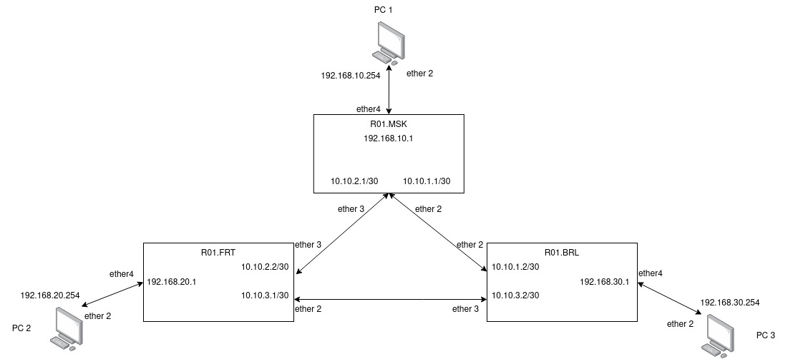
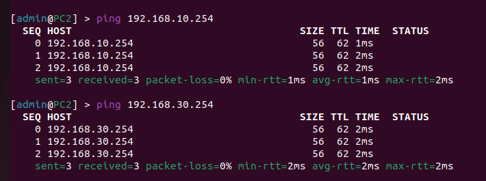
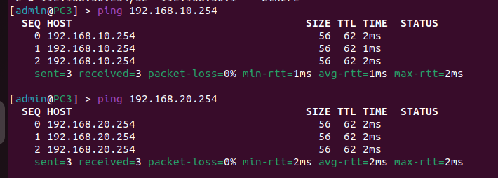

University: [ITMO University](https://itmo.ru/ru/)

Faculty: [FICT](https://fict.itmo.ru)

Course: [Introduction in routing](https://github.com/itmo-ict-faculty/introduction-in-routing)

Year: 2022/2023 

Group: K33202

Author: Guliaeva Alisa 

Lab: Lab2 

Date of create: 22.11.2022 

Date of finished: 02.12.2022

<h1>Отчет по лабораторной №2</h1>
<h2>"Эмуляция распределенной  корпоративной сети связи, настройка статической маршрутизации между филиалами"</h2>
<h3>Схема сети</h3>
<h3>Текст конфигураций для сетевых устройств</h3>

<h4>Для R01.MSK (sudo ssh admin@172.20.20.8)</h4>

<pre><code>
/ip pool
add name=pool1 ranges=192.168.10.10-192.168.10.254
/ip dhcp-server
add address-pool=pool1 disabled=no interface=ether4 name=dhcp1
/ip address
add address=172.15.255.30/30 interface=ether1 network=172.15.255.28
add address=10.10.1.1/30 interface=ether2 network=10.10.1.0
add address=10.10.2.1/30 interface=ether3 network=10.10.2.0
add address=192.168.10.1/24 interface=ether4 network=192.168.10.0
/ip dhcp-client
add disabled=no interface=ether1
/ip route
add distance=1 dst-address=192.168.20.0/24 gateway=10.10.2.2
add distance=1 dst-address=192.168.30.0/24 gateway=10.10.1.2
/system identity
set name=R01.MSK
</code></pre>

<h4>Для R01.FRT (sudo ssh admin@172.20.20.9)</h4>

<pre><code>
/ip pool
add name=pool2 ranges=192.168.20.10-192.168.20.254
/ip dhcp-server
add address-pool=pool2 disabled=no interface=ether4 name=dhcp2
/ip address
add address=172.15.255.30/30 interface=ether1 network=172.15.255.28
add address=10.10.2.2/30 interface=ether3 network=10.10.2.0
add address=10.10.3.1/30 interface=ether2 network=10.10.3.0
add address=192.168.20.1/24 interface=ether4 network=192.168.20.0
/ip dhcp-client
add disabled=no interface=ether1
/ip route
add distance=1 dst-address=192.168.10.0/24 gateway=10.10.2.1
add distance=1 dst-address=192.168.30.0/24 gateway=10.10.3.2
/system identity
set name=R01.FRT
</code></pre>

<h4>Для R01.BRL (sudo ssh admin@172.20.20.7)</h4>

<pre><code>
//ip pool
add name=pool3 ranges=192.168.30.10-192.168.30.254
/ip dhcp-server
add address-pool=pool3 disabled=no interface=ether4 name=dhcp3
/ip address
add address=172.15.255.30/30 interface=ether1 network=172.15.255.28
add address=10.10.1.2/30 interface=ether2 network=10.10.1.0
add address=10.10.3.2/30 interface=ether3 network=10.10.3.0
add address=192.168.30.1/24 interface=ether4 network=192.168.30.0
/ip dhcp-client
add disabled=no interface=ether1
/ip route
add distance=1 dst-address=192.168.10.0/24 gateway=10.10.1.1
add distance=1 dst-address=192.168.20.0/24 gateway=10.10.3.1
/system identity
set name=R01.BRL
</code></pre>

<h4>Для PC1 (sudo ssh admin@172.20.20.3)</h4>

<pre><code>
/ip address
add address=172.15.255.30/30 interface=ether1 network=172.15.255.28
/ip dhcp-client
add disabled=no interface=ether1
add disabled=no interface=ether2
/ip route
add distance=1 dst-address=10.10.1.0/30 gateway=192.168.10.1
add distance=1 dst-address=10.10.2.0/30 gateway=192.168.10.1
add distance=1 dst-address=192.168.20.0/24 gateway=192.168.10.1
add distance=1 dst-address=192.168.30.0/24 gateway=192.168.10.1
/system identity
set name=PC1
</code></pre>

<h4>Для PC2 (sudo ssh admin@172.20.20.5)</h4>
<pre><code>
/ip address
add address=172.15.255.30/30 interface=ether1 network=172.15.255.28
/ip dhcp-client
add disabled=no interface=ether1
add disabled=no interface=ether2
/ip route
add distance=1 dst-address=10.10.2.0/30 gateway=192.168.20.1
add distance=1 dst-address=10.10.3.0/30 gateway=192.168.20.1
add distance=1 dst-address=192.168.10.0/24 gateway=192.168.20.1
add distance=1 dst-address=192.168.30.0/24 gateway=192.168.20.1
/system identity
set name=PC2
</code></pre>

<h4>Для PC3 (sudo ssh admin@172.20.20.4)</h4>
<pre><code>
/ip address
add address=172.15.255.30/30 interface=ether1 network=172.15.255.28
/ip dhcp-client
add disabled=no interface=ether1
add disabled=no interface=ether2
/ip route
add distance=1 dst-address=10.10.1.0/30 gateway=192.168.30.1
add distance=1 dst-address=10.10.3.0/30 gateway=192.168.30.1
add distance=1 dst-address=192.168.10.0/24 gateway=192.168.30.1
add distance=1 dst-address=192.168.20.0/24 gateway=192.168.30.1
/system identity
set name=PC3
</code></pre>

<h3>Результаты пингов</h3>
<figcaption>Результаты пингов, проверки локальной связности на PC1</figcaption>

<figcaption>>Результаты пингов, проверки локальной связности на PC2</figcaption>

<figcaption>>Результаты пингов, проверки локальной связности на PC3</figcaption>

