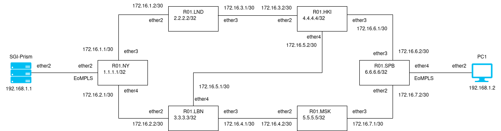
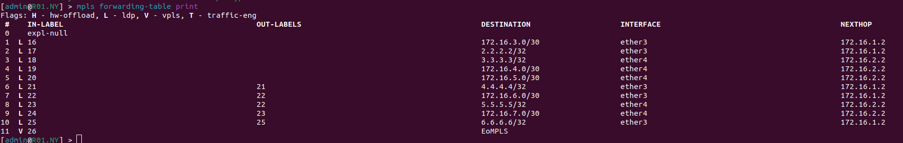
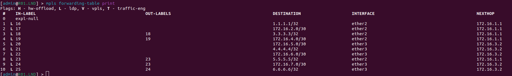
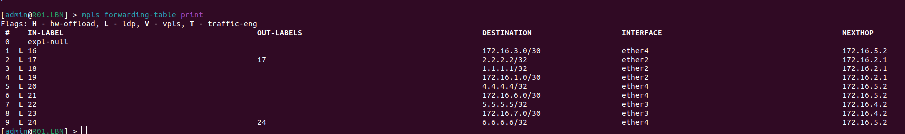
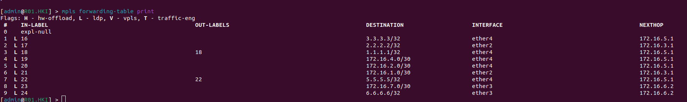
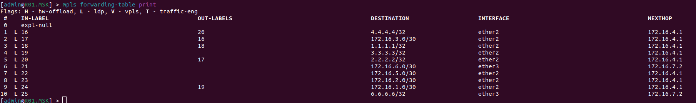
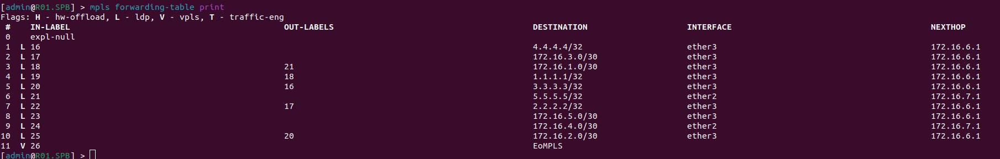
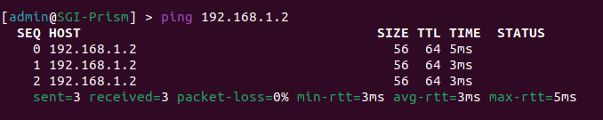

University: [ITMO University](https://itmo.ru/ru/)

Faculty: [FICT](https://fict.itmo.ru)

Course: [Introduction in routing](https://github.com/itmo-ict-faculty/introduction-in-routing)

Year: 2022/2023 

Group: K33202

Author: Guliaeva Alisa 

Lab: Lab2 

Date of create: 02.12.2022 

Date of finished: 16.12.2022

<h1>Отчет по лабораторной №3</h1>
<h2>"Эмуляция распределенной корпоративной сети связи, настройка OSPF и MPLS, организация первого EoMPLS"</h2>
<h3>Схема сети</h3>

<h3>Текст конфигураций для сетевых устройств</h3>
<h4>Для R01.NY (sudo ssh admin@172.20.20.2)</h4>

<pre><code>
/interface bridge
add name=EoMPLS_B
add name=Lo0
/interface vpls
add cisco-style=yes cisco-style-id=666 disabled=no l2mtu=1500 mac-address=02:E0:6E:AC:1D:66 name=EoMPLS remote-peer=6.6.6.6
/interface wireless security-profiles
set [ find default=yes ] supplicant-identity=MikroTik
/routing ospf instance
set [ find default=yes ] router-id=1.1.1.1
/interface bridge port
add bridge=EoMPLS_B interface=EoMPLS
add bridge=EoMPLS_B interface=ether2
/ip address
add address=172.31.255.30/30 interface=ether1 network=172.31.255.28
add address=172.16.1.1/30 interface=ether3 network=172.16.1.0
add address=172.16.2.1/30 interface=ether4 network=172.16.2.0
add address=1.1.1.1 interface=Lo0 network=1.1.1.1
/ip dhcp-client
add disabled=no interface=ether1
/mpls ldp
set enabled=yes transport-address=1.1.1.1
/mpls ldp interface
add interface=ether3
add interface=ether4
/routing ospf network
add area=backbone
/system identity
set name=R01.NY
</code></pre>

<h4>Для R01.LND (sudo ssh admin@172.20.20.3)</h4>

<pre><code>
/interface bridge
add name=Lo0
/interface wireless security-profiles
set [ find default=yes ] supplicant-identity=MikroTik
/routing ospf instance
set [ find default=yes ] router-id=2.2.2.2
/ip address
add address=172.31.255.30/30 interface=ether1 network=172.31.255.28
add address=172.16.1.2/30 interface=ether2 network=172.16.1.0
add address=172.16.3.1/30 interface=ether3 network=172.16.3.0
add address=2.2.2.2 interface=Lo0 network=2.2.2.2
/ip dhcp-client
add disabled=no interface=ether1
/mpls ldp
set enabled=yes transport-address=2.2.2.2
/mpls ldp interface
add interface=ether2
add interface=ether3
/routing ospf network
add area=backbone
/system identity
set name=R01.LND
</code></pre>

<h4>Для R01.LBN (sudo ssh admin@172.20.20.4)</h4>

<pre><code>
/interface bridge
add name=Lo0
/interface wireless security-profiles
set [ find default=yes ] supplicant-identity=MikroTik
/routing ospf instance
set [ find default=yes ] router-id=3.3.3.3
/ip address
add address=172.31.255.30/30 interface=ether1 network=172.31.255.28
add address=172.16.2.2/30 interface=ether2 network=172.16.2.0
add address=172.16.4.1/30 interface=ether3 network=172.16.4.0
add address=172.16.5.1/30 interface=ether4 network=172.16.5.0
add address=3.3.3.3 interface=Lo0 network=3.3.3.3
/ip dhcp-client
add disabled=no interface=ether1
/mpls ldp
set enabled=yes transport-address=3.3.3.3
/mpls ldp interface
add interface=ether2
add interface=ether3
add interface=ether4
/routing ospf network
add area=backbone
/system identity
set name=R01.LBN

</code></pre>

<h4>Для R01.HKI (sudo ssh admin@172.20.20.5)</h4>

<pre><code>
/interface bridge
add name=Lo0
/interface wireless security-profiles
set [ find default=yes ] supplicant-identity=MikroTik
/routing ospf instance
set [ find default=yes ] router-id=4.4.4.4
/ip address
add address=172.31.255.30/30 interface=ether1 network=172.31.255.28
add address=172.16.3.2/30 interface=ether2 network=172.16.3.0
add address=172.16.6.1/30 interface=ether3 network=172.16.6.0
add address=172.16.5.2/30 interface=ether4 network=172.16.5.0
add address=4.4.4.4 interface=Lo0 network=4.4.4.4
/ip dhcp-client
add disabled=no interface=ether1
/mpls ldp
set enabled=yes transport-address=4.4.4.4
/mpls ldp interface
add interface=ether2
add interface=ether3
add interface=ether4
/routing ospf network
add area=backbone
/system identity
set name=R01.HKI

</code></pre>

<h4>Для R01.MSK (sudo ssh admin@172.20.20.6)</h4>

<pre><code>
/interface bridge
add name=Lo0
/interface wireless security-profiles
set [ find default=yes ] supplicant-identity=MikroTik
/routing ospf instance
set [ find default=yes ] router-id=5.5.5.5
/ip address
add address=172.31.255.30/30 interface=ether1 network=172.31.255.28
add address=172.16.4.2/30 interface=ether2 network=172.16.4.0
add address=172.16.7.1/30 interface=ether3 network=172.16.7.0
add address=5.5.5.5 interface=Lo0 network=5.5.5.5
/ip dhcp-client
add disabled=no interface=ether1
/mpls ldp
set enabled=yes transport-address=5.5.5.5
/mpls ldp interface
add interface=ether2
add interface=ether3
/routing ospf network
add area=backbone
/system identity
set name=R01.MSK
</code></pre>

<h4>Для R01.SPB (sudo ssh admin@172.20.20.7)</h4>

<pre><code>
/interface bridge
add name=EoMPLS_B
add name=Lo0
/interface vpls
add cisco-style=yes cisco-style-id=666 disabled=no l2mtu=1500 mac-address=02:92:C4:B7:BC:22 name=EoMPLS remote-peer=1.1.1.1
/interface wireless security-profiles
set [ find default=yes ] supplicant-identity=MikroTik
/routing ospf instance
set [ find default=yes ] router-id=6.6.6.6
/interface bridge port
add bridge=EoMPLS_B interface=EoMPLS
add bridge=EoMPLS_B interface=ether4
/ip address
add address=172.31.255.30/30 interface=ether1 network=172.31.255.28
add address=172.16.7.2/30 interface=ether2 network=172.16.7.0
add address=172.16.6.2/30 interface=ether3 network=172.16.6.0
add address=6.6.6.6 interface=Lo0 network=6.6.6.6
/ip dhcp-client
add disabled=no interface=ether1
/mpls ldp
set enabled=yes transport-address=6.6.6.6
/mpls ldp interface
add interface=ether2
add interface=ether3
/routing ospf network
add area=backbone
/system identity
set name=R01.SPB
</code></pre>

<h4>Для PC1 (sudo ssh admin@172.20.20.9)</h4>

<pre><code>
/interface wireless security-profiles
set [ find default=yes ] supplicant-identity=MikroTik
/ip address
add address=172.31.255.30/30 interface=ether1 network=172.31.255.28
add address=192.168.1.2/24 interface=ether2 network=192.168.1.0
/ip dhcp-client
add disabled=no interface=ether1
/system identity
set name=PC1
</code></pre>

<h4>Для SGI-Prism (sudo ssh admin@172.20.20.8)</h4>
<pre><code>
/interface wireless security-profiles
set [ find default=yes ] supplicant-identity=MikroTik
/ip address
add address=172.31.255.30/30 interface=ether1 network=172.31.255.28
add address=192.168.1.1/24 interface=ether2 network=192.168.1.0
/ip dhcp-client
add disabled=no interface=ether1
/system identity
set name=SGI-Prism
</code></pre>

<figcaption>Выкладки с маршрутами</figcaption>

<h3>Результат пингов</h3>
<figcaption>Результаты пингов, проверки локальной связности</figcaption>

<h3>Вывод</h3>

В ходе работы были изучены протоколы OSPF и MPLS, механизмы организации EoMPLS.

